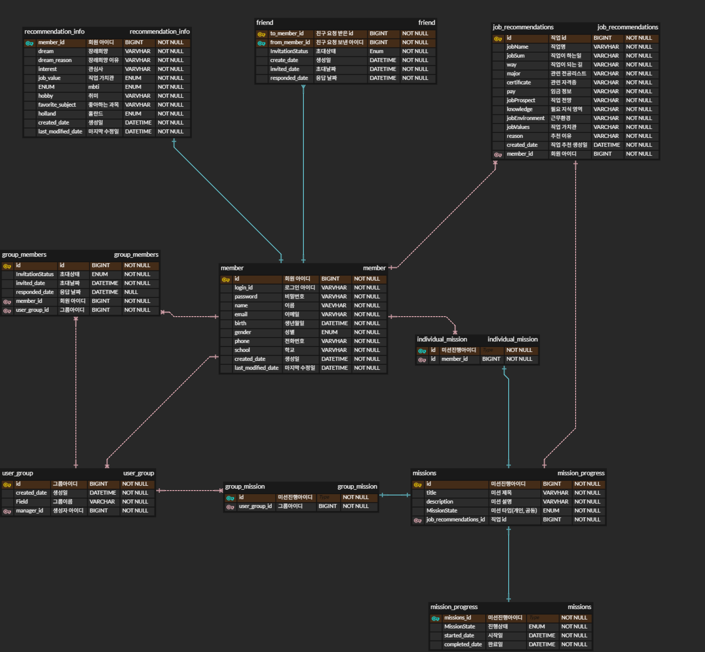

# What Will You Be - Backend

진로 추천 시스템의 백엔드 API 서버입니다.

## 📋 프로젝트 개요

**What Will You Be**는 사용자의 성향, MBTI, 홀랜드 유형 등을 분석하여 맞춤형 직업을 추천하는 시스템입니다.

### 주요 기능
- ✅ 회원가입 / 로그인 (JWT 인증)
- ✅ 개인 프로필 관리
- ✅ 직업 추천 정보 입력 및 관리
- ✅ **직업 추천 API (Python API 연동 완료)**
- ✅ 직업 추천 결과 저장 및 조회
- ✅ 옵션 조회 API (성별, MBTI, 홀랜드, 직업가치관)
- 🚧 친구 관계 관리 (도메인 설계 완료)
- 🚧 개인/그룹 미션 시스템 (도메인 설계 완료)

## 🛠 기술 스택

- **Java 17**
- **Spring Boot 3.5.0**
- **Spring Security 6.x**
- **Spring Data JPA (Hibernate)**
- **MySQL 8.0**
- **JWT (JSON Web Token)**
- **RestClient** (Python API 연동)
- **Gradle 8.14.2**
- **Lombok**
- **Validation**

## 📊 데이터베이스 설계



### 주요 엔티티
- **Member**: 회원 정보
- **RecommendationInfo**: 추천을 위한 사용자 정보 (MBTI, 홀랜드, 직업가치관 등)
- **JobRecommendations**: 직업 추천 결과
- **Friend**: 친구 관계 (복합키 사용)
- **Missions**: 미션 시스템 (상속 구조)
  - **IndividualMission**: 개인 미션
  - **GroupMission**: 그룹 미션
- **MissionProgress**: 미션 진행 상황

> **참고**: 미션(Mission) 관련 테이블들은 JPA의 `@Inheritance(strategy = InheritanceType.JOINED)` 전략을 사용하여 구현되었습니다.

## 🚀 시작하기

### 사전 요구사항

- Java 17 이상
- MySQL 8.0
- Gradle
- Python API 서버 (http://127.0.0.1:8000)

### 설치 및 실행

1. **저장소 클론**
   ```bash
   git clone <repository-url>
   cd what-will-you-be/backend
   ```

2. **데이터베이스 설정**
   ```sql
   CREATE DATABASE what_will_you_be;
   ```

3. **애플리케이션 설정**
   
   `src/main/resources/application.yml` 파일에서 데이터베이스 연결 정보를 확인/수정하세요:
   ```yaml
   spring:
     datasource:
       url: jdbc:mysql://127.0.0.1:3306/what_will_you_be?useSSL=false&useUnicode=true&serverTimezone=Asia/Seoul
       username: root
       password: 1234  # 본인의 MySQL 비밀번호로 변경
   
   jwt:
     secret:
       key: bXlTdXBlclNlY3JldEtleTEyMzQ1Njc4OTAhQCMkJV4=
     token:
       expiration: 1800000  # 30분
   ```

4. **애플리케이션 실행**
   ```bash
   ./gradlew bootRun
   ```

서버는 기본적으로 `http://localhost:8080`에서 실행됩니다.

## 📡 API 엔드포인트

### 🔐 회원 관리
- `POST /api/members/signup` - 회원가입
- `GET /api/members/check-loginid/{loginId}` - 아이디 중복 확인
- `POST /api/members/login` - 로그인 (JWT 토큰 발급)
- `GET /api/members/me` - 내 정보 조회 🔒
- `PATCH /api/members/me` - 내 정보 수정 🔒
- `DELETE /api/members/me` - 회원 탈퇴 🔒

### 📝 추천 정보 관리
- `GET /api/recommendation-info` - 추천 정보 조회 🔒
- `PUT /api/recommendation-info` - 추천 정보 등록/수정 🔒

### 🎯 직업 추천
- `POST /api/job-recommendations` - 직업 추천 생성 (Python API 연동) 🔒
- `GET /api/job-recommendations` - 내 직업 추천 목록 조회 🔒
- `GET /api/job-recommendations/{recommendationId}` - 직업 추천 상세 조회 🔒
- `DELETE /api/job-recommendations/{recommendationId}` - 직업 추천 삭제 🔒

### ⚙️ 옵션 조회
- `GET /api/options/genders` - 성별 옵션 조회
- `GET /api/options/recommendations` - 추천 관련 옵션 조회 (Holland, MBTI, JobValue)

> 🔒 표시된 API는 JWT 토큰 인증이 필요합니다.

## 🔐 인증 시스템

### JWT 토큰 기반 인증
- **토큰 만료 시간**: 30분 (1800초)
- **인증 방식**: Bearer Token
- **보안**: Spring Security 6.x 적용

### 사용 방법
1. **로그인**: `POST /api/members/login`
   ```json
   {
     "loginId": "your_id",
     "password": "your_password"
   }
   ```

2. **토큰 획득**: 응답 헤더의 `Authorization` 필드에서 토큰 확인

3. **API 요청**: 헤더에 토큰 포함
   ```
   Authorization: Bearer <your-jwt-token>
   ```

### 보안 설정
- 비밀번호 암호화: BCrypt
- CORS 설정 적용
- JWT 시크릿 키 환경 변수 관리

## 🏗 프로젝트 구조

```
src/main/java/com/example/whatwillyoube/whatwillyoube_backend/
├── config/          # 설정 클래스 (Security, App)
├── controller/      # REST 컨트롤러 (4개)
├── domain/          # 엔티티 클래스 (20개)
├── dto/            # 데이터 전송 객체 (13개)
├── repository/     # JPA 리포지토리 (3개)
├── security/       # 보안 관련 클래스
├── service/        # 비즈니스 로직 (4개)
├── util/           # 유틸리티 클래스 (JWT)
└── WhatWillYouBeBackendApplication.java
```

### 주요 컴포넌트
- **Controller**: Member, JobRecommendations, RecommendationInfo, Options
- **Service**: Member, JobRecommendations, RecommendationInfo, Recommendation
- **Security**: JWT 필터, UserDetails 구현체
- **Domain**: 완전한 엔티티 설계 (상속, 복합키 포함)

## 🗃 도메인 모델

### 👤 회원 관리
- **Member**: 회원 기본 정보, 프로필
- **Gender**: 성별 열거형

### 🎯 추천 시스템
- **RecommendationInfo**: 추천을 위한 사용자 정보
  - MBTI, Holland, JobValue 연결
  - 꿈, 관심사, 취미, 좋아하는 과목
- **JobRecommendations**: AI 추천 결과
  - 직업명, 요약, 진로 방법, 전공, 자격증
  - 연봉, 전망, 지식, 환경, 가치관, 추천 이유

### 📊 분류 체계
- **MBTI**: 16가지 성격 유형
- **Holland**: 6가지 직업 흥미 유형
- **JobValue**: 직업 가치관 (안정성, 성취감 등)

### 👥 소셜 기능 (설계 완료)
- **Friend**: 친구 관계 (복합키)
- **Groups**: 그룹 관리
- **GroupMembers**: 그룹 멤버십

### 🎮 미션 시스템 (설계 완료)
- **Missions**: 추상 미션 클래스
  - **IndividualMission**: 개인 미션
  - **GroupMission**: 그룹 미션
- **MissionProgress**: 미션 진행 상황
- **MissionState**: 미션 상태 (진행중, 완료 등)
- **MissionType**: 미션 유형

## 🔧 개발 환경 설정

### JPA 설정
- **DDL 모드**: `validate` (운영 환경 안전)
- **SQL 로깅**: 활성화 (개발용)
- **데이터베이스**: MySQL 8.0 Dialect

```yaml
spring:
  jpa:
    hibernate:
      ddl-auto: validate  # 운영: validate, 개발: update
    show-sql: true
    properties:
      hibernate:
        format_sql: true
        use_sql_comments: true
```

### 로깅 레벨
```yaml
logging:
  level:
    org.hibernate.SQL: debug
    org.hibernate.type: trace
```

### 개발 시 주의사항
- Python API 서버가 `http://127.0.0.1:8000`에서 실행 중이어야 함
- JWT 시크릿 키는 Base64 인코딩된 값 사용
- 데이터베이스 스키마는 수동으로 관리 (validate 모드)

## 🧪 테스트

```bash
./gradlew test
```

## 🐍 Python API 연동

### AI 추천 시스템 연동
- **서비스**: RecommendationService
- **HTTP 클라이언트**: Spring RestClient
- **연동 방식**: 동기 REST API 호출

### API 명세
- **URL**: `http://127.0.0.1:8000/api/recommend/`
- **Method**: POST
- **Content-Type**: application/json

### 요청/응답 구조
**요청 (PythonApiRequestDto)**:
```json
{
  "dream": "소프트웨어 개발자",
  "interest": "프로그래밍, 기술",
  "jobValue": "STABILITY",
  "mbti": "INTJ",
  "hobby": "코딩, 독서",
  "favoriteSubject": "수학, 과학",
  "holland": "INVESTIGATIVE"
}
```

**응답 (PythonApiResponseDto)**:
```json
{
  "recommendedJobs": [
    {
      "jobName": "백엔드 개발자",
      "jobSum": "서버 시스템 개발",
      "way": "컴퓨터공학 전공 후 실무 경험",
      "major": "컴퓨터공학, 소프트웨어공학",
      "certificate": "정보처리기사",
      "pay": "4000-8000만원",
      "jobProspect": "매우 좋음",
      "knowledge": "프로그래밍, 데이터베이스",
      "jobEnvironment": "사무실, 재택근무 가능",
      "jobValues": "창조성, 안정성",
      "reason": "INTJ 성향과 프로그래밍 관심사가 일치"
    }
  ]
}
```

### 처리 흐름
1. 사용자 추천 정보 조회 (RecommendationInfo)
2. Python API 요청 데이터 변환
3. RestClient로 AI 서버 호출
4. 응답 데이터를 JobRecommendations 엔티티로 변환
5. 데이터베이스 저장 및 결과 반환

## 📝 개발 현황 및 계획

### ✅ 완료된 기능
- 회원 관리 시스템 (가입, 로그인, 프로필)
- JWT 기반 인증/인가
- 추천 정보 관리
- AI 직업 추천 (Python API 연동)
- 추천 결과 저장/조회/삭제
- 옵션 조회 API
- 완전한 도메인 모델 설계

### 🚧 진행 예정
- [ ] 친구 시스템 API 구현
- [ ] 그룹 관리 API
- [ ] 미션 시스템 API
- [ ] 미션 진행 상황 관리
- [ ] 알림 시스템
- [ ] 관리자 기능

### 🔧 기술 개선 계획
- [ ] 예외 처리 표준화
- [ ] API 문서 자동화 (Swagger)
- [ ] 테스트 코드 작성
- [ ] 로깅 시스템 개선
- [ ] 성능 최적화

## 🚀 배포 및 운영

### 환경별 설정
- **개발**: `ddl-auto: update`, SQL 로깅 활성화
- **운영**: `ddl-auto: validate`, 로깅 최소화

### 필수 환경 변수
```bash
DB_URL=jdbc:mysql://localhost:3306/what_will_you_be
DB_USERNAME=root
DB_PASSWORD=your_password
JWT_SECRET=your_jwt_secret_key
PYTHON_API_URL=http://127.0.0.1:8000
```

## 🧪 테스트

```bash
# 전체 테스트 실행
./gradlew test

# 빌드
./gradlew build

# 실행
./gradlew bootRun
```

## 📞 문의 및 지원

- **이슈 리포트**: GitHub Issues
- **기능 요청**: GitHub Discussions
- **문서**: 프로젝트 Wiki

---

**개발팀** | What Will You Be Project  
**최종 업데이트** | 2024년 12월